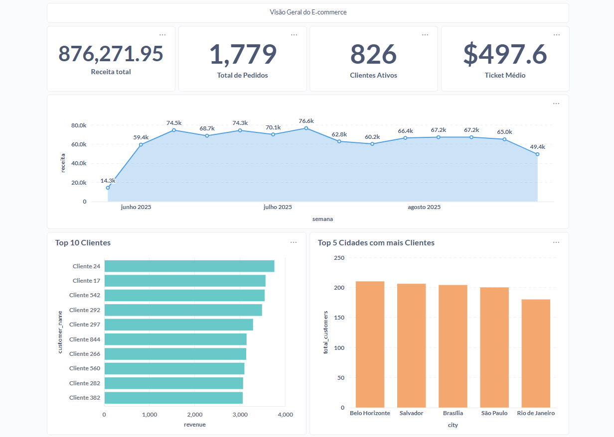

### 📂 `readmes/07-monitoramento-dashboards.md`

Este módulo documenta como monitorar e visualizar os dados do e-commerce por meio de dashboards conectados ao **Athena** (consultando diretamente arquivos Parquet no S3).

## 🔶 Objetivo

- Ter visibilidade em tempo real das vendas
- Acompanhar os principais KPIs do negócio
- Explorar dados diretamente no S3 sem necessidade de carga intermediária

## 🔶 Estrutura

```bash
flowchart LR
  A[S3: mart/*.parquet] -->|Glue Crawler| B[Glue Data Catalog]
  B --> C[Athena]
  C --> D[Metabase Dashboard]
```

## 🔶 Configuração

### 1. Glue Data Catalog
- Criar um Crawler no Glue apontando para:
    - ``s3://ecommerce-datalake-project/mart/``
- Database criado: ``ecommerce_db``
- Tabelas disponíveis:
    - ``dim_customers``
    - ``fact_sales``
### 2. Athena
- Configurar Query result location:
    - ``s3://ecommerce-datalake-project/queries-athena/``
- Validar no console:
```bash
SHOW TABLES IN ecommerce_db;
SELECT COUNT(*) FROM ecommerce_db.fact_sales;
```

### 3. Metabase
- Tipo: **Amazon Athena**
- Configuração usada:
    - **Region:** ``sa-east-1``
    - **Workgroup:** ``primary``
    - **S3 staging directory:** ``s3://ecommerce-datalake-project/queries-athena/``
    - **Catalog:** ``AwsDataCatalog``
    - **Database:** ``ecommerce_db``

> Os nomes dados para a configuração do metabase devem ser ajustados para os quais você definiu dentro do console AWS.

## 🔶 Dashboards no Metabase

1. Receita total (KPI)

```
SELECT ROUND(SUM(total_value), 2) AS receita
FROM ecommerce_db.fact_sales;
```

2. Total de Pedidos (KPI)

```
SELECT COUNT(DISTINCT order_id) AS total_orders
FROM ecommerce_db.fact_sales;
```

3. Clientes Ativos (KPI)
```
SELECT COUNT(DISTINCT customer_id) AS active_customers
FROM ecommerce_db.fact_sales;
```

4. Ticket médio (KPI)
```
SELECT ROUND(AVG(total_value), 2) AS avg_ticket
FROM ecommerce_db.fact_sales;
```

5. Receita por semana (linha)

```
SELECT
  date_trunc('week', date_parse(order_date, '%Y-%m-%d')) AS semana,
  SUM(total_value) AS receita
FROM ecommerce_db.fact_sales
GROUP BY 1
ORDER BY 1;
```

6. Top 10 clientes (barras)

```
SELECT c.customer_name, ROUND(SUM(f.total_value),2) AS revenue
FROM ecommerce_db.fact_sales f
JOIN ecommerce_db.dim_customers c
  ON f.customer_id = c.customer_id
GROUP BY c.customer_name
ORDER BY revenue DESC
LIMIT 10;
```

7. Top 5 Cidades com mais Clientes (barras)
```
SELECT city, COUNT(*) AS total_customers
FROM ecommerce_db.dim_customers
GROUP BY city
ORDER BY total_customers DESC
LIMIT 5;
```

## 🔶 Resultado

### Dashboard do Ecommerce



<hr style="height:2px; background-color:#807f7e; border:none;">
